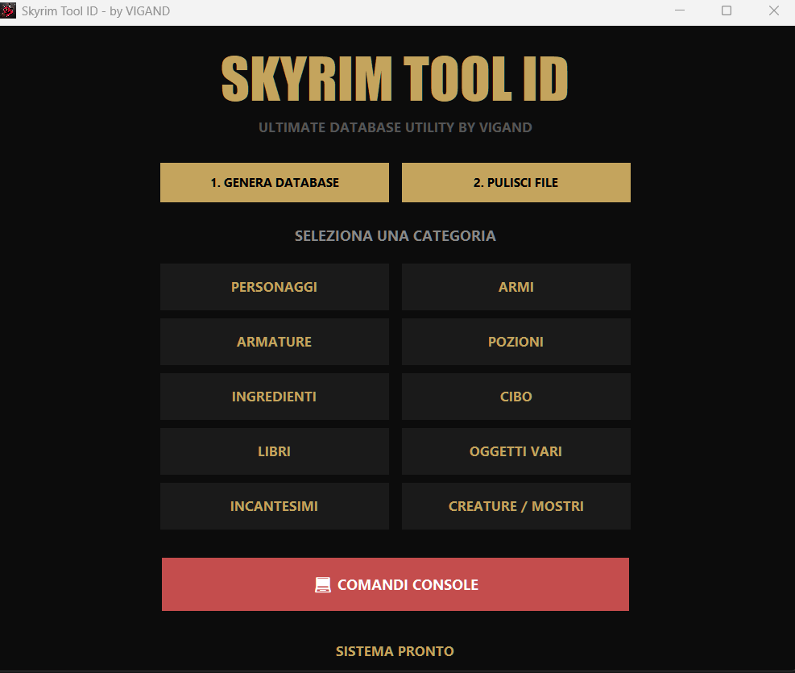

# 🐉 Skyrim Tool ID
**The Ultimate Database Utility for Skyrim Special Edition & Anniversary Edition**

👤 **Author:** [VIGAND](https://github.com/Vigand79) | 🎮 **Game:** [Skyrim SE / AE](https://www.nexusmods.com/skyrimspecialedition/mods/179016)
---

## 🚀 Che cos'è Skyrim Tool ID?
**Skyrim Tool ID** non è una semplice lista statica di codici. È un'applicazione dinamica che scansiona in tempo reale il **TUO specifico ordine di caricamento**. 

Mentre le liste online forniscono ID generici che spesso non funzionano a causa dei plugin attivi, questo tool estrae i dati direttamente dai tuoi file di gioco tramite **SSEEdit**. Questo garantisce che ogni ID trovato sia **funzionante al 100%** nella tua partita attuale, incluse le armi, le magie e gli NPC aggiunti dalle mod.

---

## ✨ Caratteristiche Avanzate

*   **🔄 Sincronizzazione Reale del Load Order**
    Il tool legge la tua installazione attuale. Se installi una nuova mod o sposti un plugin, il database si aggiorna istantaneamente con i nuovi indici esadecimali corretti.
*   **🛡️ Sistema Anti-Clone (RefID vs BaseID)**
    L'unico tool progettato per rispettare l'integrità del tuo salvataggio. Distingue tra l'originale (RefID) e lo stampo (BaseID):
    *   **TELEPORT:** Sposta l'NPC originale davanti a te (Zero cloni, sicuro per le quest).
    *   **CLONE:** Crea una copia nuova da zero (Utile per esperimenti o eserciti).
*   **🧠 Filtro Intelligente Creature/Umani**
    Grazie a un algoritmo di analisi dei record FaceGen, il tool separa automaticamente gli NPC "umani" (Lydia, Serana, Jarl) dai mostri e animali (Skeever, Draghi, Lupi).
*   **⚡ Ricerca Istantanea Anti-Lag**
    Gestisce database enormi (50.000+ record) senza rallentamenti grazie al sistema di "Debounce" integrato.
*   **💻 Libreria Console Integrata**
    Oltre 140 comandi console pronti all'uso per debug, meteo, quest e altro.

---

## 🛠️ Istruzioni per l'uso

### 1. Preparazione in SSEEdit
1.  Avvia **SSEEdit (xEdit)** e carica tutti i tuoi plugin.
2.  Attendi il caricamento completo (scritta verde *"Background Loader: finished"*).
3.  Nella finestra di sinistra, seleziona i plugin da scansionare (**CTRL+A** per tutti).
4.  Tasto destro su un plugin e seleziona **"Apply Script"**. Si aprirà una finestra bianca.

### 2. Generazione Database
1.  Avvia **Skyrim Tool ID** e clicca su **"1. GENERA DATABASE"**.
2.  Hai **10 secondi**: clicca subito all'interno della casella bianca di SSEEdit.
3.  Il tool scriverà lo script e avvierà l'export. **Non toccare il PC** finché non appare il messaggio di conferma.

### 3. In Gioco
1.  Seleziona una categoria e cerca l'oggetto.
2.  Clicca su **"COPIA"**.
3.  In Skyrim, apri la console (tasto `\` o `~`) e premi **CTRL+V**.

---

## 📦 Requisiti e Sicurezza
*   **SSEEdit (xEdit):** Necessario per l'estrazione dati.
*   **Microsoft Visual C++ Redistributable (x64):** Obbligatorio per l'avvio.
*   **Nota Antivirus:** Il tool è compilato in C++ (Nuitka). Alcuni software potrebbero segnalare un "Falso Positivo" perché il tool automatizza la tastiera. Il codice è sicuro, pulito e testato.

---

## 📸 Screenshot

  
  
  > **Interfaccia Avanzata:** Design moderno in stile Skyrim, ottimizzato per risoluzioni 1000x800/860 con sistema di navigazione a pagine per gestire migliaia di record senza lag.

---

## 👨‍💻 Developer
Sviluppato con passione da **VIGAND**. Dedicato alla community di Skyrim Modding.

*Se trovi utile questa utility, non dimenticare di lasciare un **Endorse** su Nexus Mods o una **Star** su GitHub!*